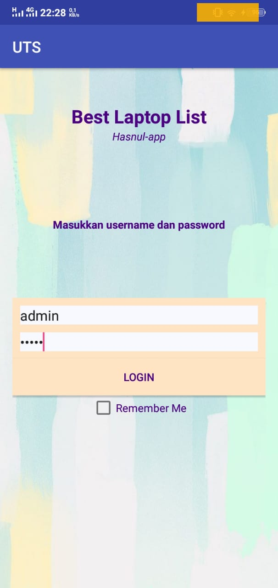
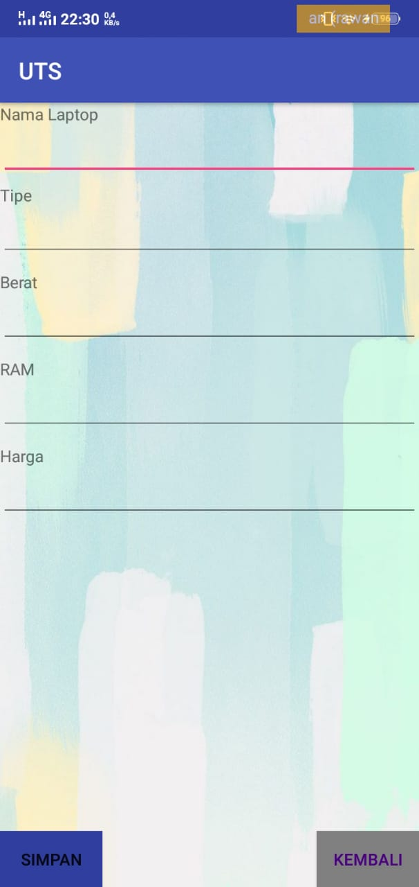
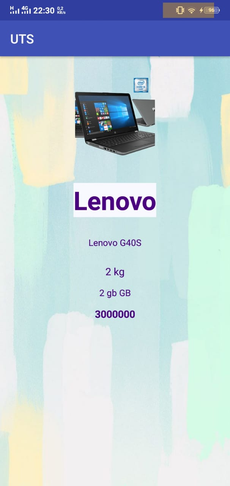
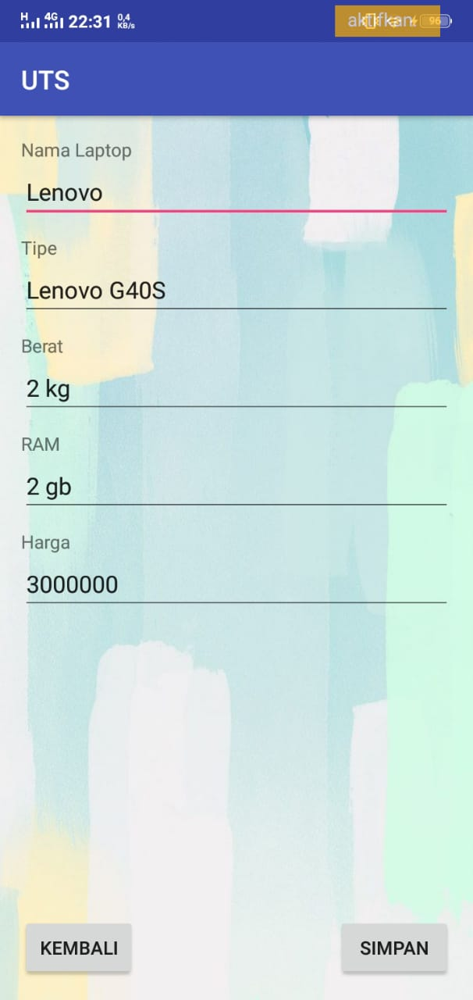

## Best Laptop List
| Grup | 12 |
| :---------------: | :---------------:|
| Hasna Alifira | 13 |
| Nurul Istikhomah | 22 |

## Deskripsi
Best Laptop List adalah sebuah aplikasi yang digunakan untuk mengetahui daftar laptop terbaik dan spesifikasinya yaitu terdapat tipe laptop, berat, ram dan harga laptop 

## SDK Requirment
Grandle Build v28 Minimum Android API 22, Android Version 5.1 (Lollipop)

## List Class

+ Main Activity.java digunakan untuk mengelola halaman login
+ HomeActivity.java digunakan untuk mengelola tampilan list dan menu view, edit, delete
+ MenuModel.java dugunakan untuk membuat kelas model dengan atribut yang sama dengan kolom pada sql
+ MyDataHelper.java digunakan untuk membuat database dan tabel SQLite
+ MenuAdapter.java digunakan untuk mengeset data
+ ViewLaptop.java digunakan untuk menampilkan data
+ InsertLaptop.java digunakan untuk menambahkan data
+ UpdateLaptop.java digunakan untuk mengedit data yang sudah ada

## Referensi
* https://stackoverflow.com/question/14530535/android-java-lang-illegalstateexception-could-not-execute-method-of-the-activity
* https://stackoverflow.com/question/6817870/asp-net-strange-compilation-error
* https://stackoverflow.com/question/17054000/cannot-resolve-symbol-r-in-android-studio
* Modul Pemrograman Perangkat Mobile

## Tampilan Aplikasi

